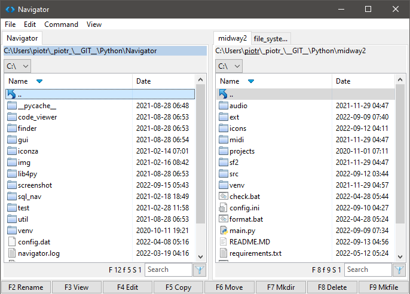
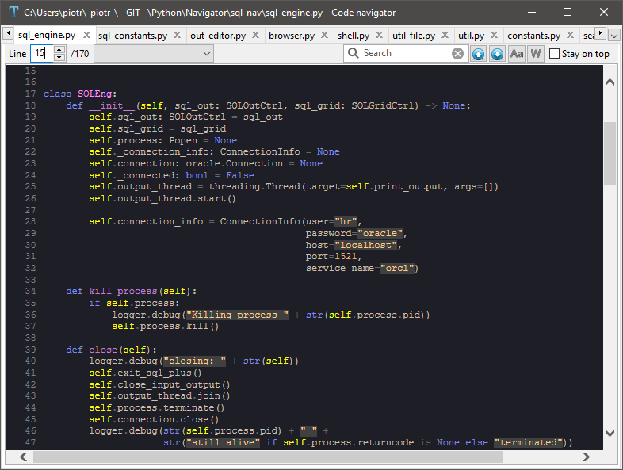

# Navigator

First attempt to create ergonomic alternative to built-in Windows file explorer (see final solution [here](https://github.com/ppiecha/file_system)).
Project explores wxPython package (wxWidgets library)\
One of cool features is built-in source code viewer which uses python Pygments package to produce HTML with highlighted syntax. 
This viewer was replaced by integration with Notepad++ and VS Code in final solution.

